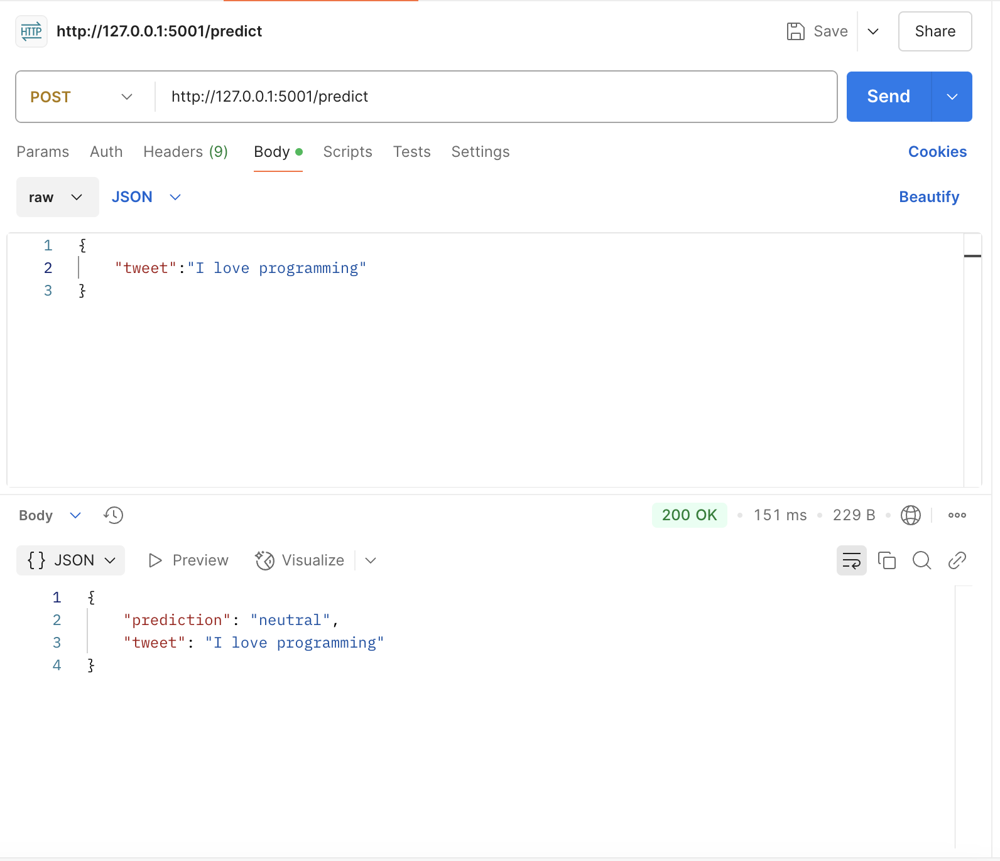

# **Hate Speech Detection - ONNX Model Export**

## Overview
This repository contains a **hate speech classification model** based on **BERT**, originally implemented in **PyTorch** and later exported to **ONNX format**. The model classifies text into:
- **Hate Speech**
- **Offensive Language**
- **Neutral Speech**

The goal of this project is to optimize the model for **faster inference** using ONNXRuntime.

---
## Steps to set-up the environment and run the project:

1. Clone this repo to your local machine using git clone
```python
git clone https://github.com/juhimanishjain/hate-speech-prediction-onnx.git
cd hate-speech-prediction-onnx
```
2. Create a virtual environment (recommended for isolation) and install dependencies:

```bash
python3 -m venv venv
source venv/bin/activate  # On Windows use: venv\Scripts\activate
pip install -r requirements.txt # install dependencies
```
3. Download the model from the following link: (https://drive.google.com/file/d/17rp7UQnYl-bLbEygnRad1aq8-KjYlZ8E/view?usp=sharing). Place the model in the root directory of this project.

4. Run the following command to start the Flask-ML server:
   
```python
python app.py
```

By default, the server will run on port 5001. To change the port:

```python
python app.py --port 5500
```

The server will now be accessible at: 

```aurindo
http://127.0.0.1:5500/predict
```

5. Use the following cURL command to test the endpoint:

```bash
curl -X POST "http://127.0.0.1:5001/predict" \
     -H "Content-Type: application/json" \
     -d '{"tweet": "I hate you!"}'
```
Expected response:

```json
{
    "tweet": "I hate you!",
    "prediction": "hate_speech"
}
```

6. The endpoint can be accessed via any HTTP request method. Below is how to set it up in **Postman**:

#### Request Format:
- **Method:** `POST`
- **URL:**
  
  ```plaintext
  http://127.0.0.1:5001/predict
  ```
- **Headers:**
  
  ```json
  {
    "Content-Type": "application/json"
  }
  ```
- **Body:**
  - Select **raw**
  - Choose **JSON**
  - Example request body:
    
    ```json
    {
      "tweet": "I love programming!"
    }
    ```

#### Example Response:

```json
{
  "tweet": "I love programming!",
  "prediction": "neutral"
}
```



### Project Structure:
├── **model.py**                   
├── **app.py**      
├── **hate_speech_model.onnx**  
├── **requirements.txt**    
├── **cli_interface.py**   
├── **README.md**                   

- **`model.py`** → Contains the code to train and export the ONNX model.
- **`app.py`** → Serves the ONNX model via a Flask API.
- **`requirements.txt`** → Lists the required dependencies to set up the environment.
- **`hate_speech_model.onnx`** → ONNX version of this model. 
- **`cli_interface.py`** → Command Line Interface to test the model. 
- **`README.md`** → This documentation.

## Steps to export the ONNX model: 

After training, the model is exported to ONNX format using:

```python
torch.onnx.export(
    model, 
    (dummy_input["input_ids"], dummy_input["attention_mask"]),  
    "hate_speech_model.onnx",                     
    export_params=True,                   
    opset_version=13,                     
    input_names=["input_ids", "attention_mask"],  
    output_names=["output"],              
    dynamic_axes={"input_ids": {0: "batch_size"}, "attention_mask": {0: "batch_size"}, "output": {0: "batch_size"}}
)
```
## Command Line Interface

The command line interface can be used to test the model. Run the following command to test the model:

```python
python cli_interface.py 'I hate you.'
```

Result:

```python
Prediction: Hate Speech
```
